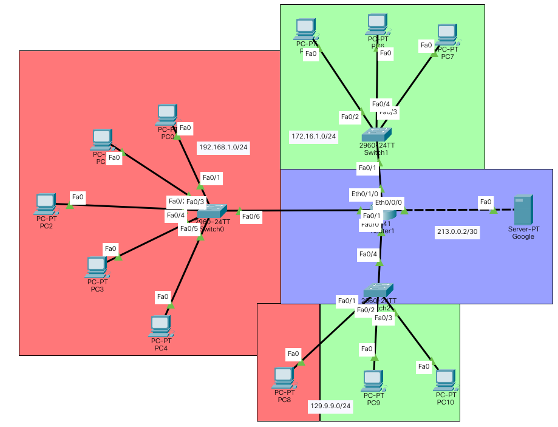

# Tutorial "How to Do Everything"

## Connect Switch to PC with VLAN


-   Connect computer to a switch, enter switch console and type:

```
en
conf t
vlan 10
exit
interface vlan 10
no shutdown
ip address 192.168.1.1 255.255.255.252
exit
interface fastEthernet 0/1
switchport mode access
switchport access vlan 10
exit
```

-   On computer, enter Ip Configuration menu and set:

    | Name            | Status          |
    | --------------- | --------------- |
    | IP Address      | 192.168.1.2     |
    | Subnet Mask     | 255.255.255.252 |
    | Default Gateway | 192.168.1.1     |

## Connect Router to PC through Switch without VLAN


-   Connect computer to a switch, then switch to a router, then enter router console and type:

```
en
conf t
interface gigabitEthernet 0/0
ip address 192.168.1.1 255.255.255.252
no shutdown
ex
```

-   On computer, enter Ip Configuration menu and set:

    | Name            | Status          |
    | --------------- | --------------- |
    | IP Address      | 192.168.1.2     |
    | Subnet Mask     | 255.255.255.252 |
    | Default Gateway | 192.168.1.1     |

## Connect Router to PC through Switch on the same VLAN


-   Enter switch terminal and type:

```
en
conf t
vlan 10
exit
interface vlan 10
no shutdown
ip add 192.168.1.2  255.255.255.248
ex
int fa 0/1
switchport mode access
switchport access vlan 10
ex
int fa 0/2
switchport mode access
switchport access vlan 10
exit
```

-   Enter router terminal and type:

```
en
conf t
interface gigabitEthernet 0/0
no sh
ip address 192.168.1.1 255.255.255.248
exit
```

-   On computer, enter Ip Configuration menu and set:

    | Name            | Status          |
    | --------------- | --------------- |
    | IP Address      | 192.168.1.3     |
    | Subnet Mask     | 255.255.255.252 |
    | Default Gateway | 192.168.1.2     |

## Connect two PCs with different VLANs through Switch and Router:


-   Connect both computers and router to switch, then open switch console and type:

```
en
conf t
vlan 10
ex
vlan 20
ex
int fa0/1
swi mode ac
swi ac vlan 10
ex
int fa 0/2
swi mo ac
swi ac vlan 20
ex
int fa 0/3
swi mo tr
sw tr all vlan 10,20
ex
```

-   Open router console and type:

```
en
conf t
int g0/0
no sh
ex
int g0/0.10
enc dot1Q 10
ip add 192.168.1.1 255.255.255.252
ex
int g0/0.20
enc do 20
ip add 176.10.1.1 255.255.255.252
ex
```

-   Set-up PC connected to fa0/1 port of the switch:

    | Name            | Status          |
    | --------------- | --------------- |
    | IP Address      | 192.168.1.2     |
    | Subnet Mask     | 255.255.255.252 |
    | Default Gateway | 192.168.1.1     |

&nbsp;

-   Set-up PC connected to fa0/2 port of the switch:

    | Name            | Status          |
    | --------------- | --------------- |
    | IP Address      | 176.10.1.2      |
    | Subnet Mask     | 255.255.255.252 |
    | Default Gateway | 176.10.1.1      |

## Connect two PCs with different VLANs through layer 3 Switch


-   Connect both PCs to the switch, then open switch console and type:

```
en
conf t
int fa 0/1
swi mo ac
sw ac vlan 10
ex
int fa 0/2
sw mo ac
sw ac vlan 20
ex
int vlan 10
ip address 192.168.1.1 255.255.255.252
ex
int vlan 20
ip address 176.10.1.1 255.255.255.252
ex
ip routing
```

-   Set-up PC connected to fa0/1 port of the switch:

    | Name            | Status          |
    | --------------- | --------------- |
    | IP Address      | 192.168.1.2     |
    | Subnet Mask     | 255.255.255.252 |
    | Default Gateway | 192.168.1.1     |

&nbsp;

-   Set-up PC connected to fa0/2 port of the switch:

    | Name            | Status          |
    | --------------- | --------------- |
    | IP Address      | 176.10.1.2      |
    | Subnet Mask     | 255.255.255.252 |
    | Default Gateway | 176.10.1.1      |

## Lab Week 1


-   In left switch console type:

```
en
conf t
int fa 0/1
swi mo ac
swi ac vlan 10
ex
int fa 0/2
swi mo ac
sw ac vlan 20
ex
int fa 0/3
sw mo tr
sw tr all vlan 10,20
ex
```

-   In right switch console type:

```
en
conf t
int fa0/2
swi mod ac
sw ac vlan 10
ex
int fa 0/3
sw mo ac
sw ac vlan 20
no sw ac vlan 20
sw ac vlan 20
ex
int fa0/1
sw mo tr
sw tr al vlan 10,20
ex
```

-   In left router console type:

```
en
conf t
Enter configuration commands, one per line.  End with CNTL/Z.
int g0/0
no sh
ex
int g0/0.10
enc
encapsulation d 10
ex
int g0/0.10
ip ad 10.0.0.1 255.255.255.252
ex
int g0/0.20
enc d 20
ex
int g0/0.20
ip add 10.0.0.5 255.255.255.252
ex
int g0/1
no sh
ip add 192.168.1.1 255.255.255.252
ex
ip route 10.0.0.8 255.255.255.252 192.168.1.2
ip route 10.0.0.12 255.255.255.252 192.168.1.2
```

-   In right router console type:

```
en
conf t
int g0/0
no sh
ex
int g0/1
no sh
ex
int g0/1.10
enc d 10
ex
int g0/1.10
ip add 10.0.0.9 255.255.255.252
ex
int g0/1.20
enc do 20
ip add 10.0.0.13 255.255.255.252
ex
int g0/0
ip add 192.168.1.2 255.255.255.252
ip route 10.0.0.0 255.255.255.252 192.168.1.1
ip route 10.0.0.4 255.255.255.252 192.168.1.1
```

-   Set-up PC connected VLAN 10:

    | Name            | Status          |
    | --------------- | --------------- |
    | IP Address      | 10.0.0.2        |
    | Subnet Mask     | 255.255.255.252 |
    | Default Gateway | 10.0.0.1        |

&nbsp;

-   Set-up PC connected VLAN 20:

    | Name            | Status          |
    | --------------- | --------------- |
    | IP Address      | 10.0.0.6        |
    | Subnet Mask     | 255.255.255.252 |
    | Default Gateway | 10.0.0.5        |

&nbsp;

-   Set-up PC connected VLAN 30:

    | Name            | Status          |
    | --------------- | --------------- |
    | IP Address      | 10.0.0.10       |
    | Subnet Mask     | 255.255.255.252 |
    | Default Gateway | 10.0.0.9        |

&nbsp;

-   Set-up PC connected VLAN 40:

    | Name            | Status          |
    | --------------- | --------------- |
    | IP Address      | 10.0.0.14       |
    | Subnet Mask     | 255.255.255.252 |
    | Default Gateway | 10.0.0.13       |

## Lab Week 2


-   Open left Router console and type:

```
en
conf t
hostname R1
aaa new-model
aaa authentication login default group tacacs+
aaa authentication enable default group tacacs+
aaa authentication login notac none
aaa authorization exec default group tacacs+
ip domain-name cisco.com
crypto key generate rsa
512
interface GigabitEthernet0/0
 ip address 10.0.0.1 255.255.255.252
 no sh
 ex
interface GigabitEthernet0/1
 ip address 10.0.0.5 255.255.255.252
 no sh
 ex
ip route 10.0.0.8 255.255.255.252 10.0.0.6
ip route 10.0.0.12 255.255.255.252 10.0.0.6
ip route 10.0.0.16 255.255.255.252 10.0.0.6
tacacs-server host 10.0.0.10 key abc
line con 0
 password 123
 login authentication notac
 exit
line vty 0 4
 transport input ssh
 exit
```

-   Open right Router console and type:

```
en
conf t
hostname R2
aaa new-model
aaa authentication login default group tacacs+
aaa authentication enable default group tacacs+
aaa authentication login notac none
aaa authorization exec default group tacacs+
ip domain-name cisco.com
crypto key generate rsa
512
interface GigabitEthernet0/0
 ip address 10.0.0.14 255.255.255.252
 no shutdown
 ex
interface GigabitEthernet0/1
 ip address 10.0.0.17 255.255.255.252
 no shutdown
 ex
ip route 10.0.0.8 255.255.255.252 10.0.0.13
ip route 10.0.0.0 255.255.255.252 10.0.0.13
ip route 10.0.0.4 255.255.255.252 10.0.0.13
tacacs-server host 10.0.0.10 key abc
line con 0
 transport output ssh
 password 123
 login authentication notac
 exit
line vty 0 4
 transport input ssh
 exit
```

-   First, in Physical mode turn off the top Router 1841, add two WIC-1ENET ports, then turn it on. Connect Server to Eth0/1/0, open Router console and type:

```
en
conf t
interface FastEthernet0/0
 ip address 10.0.0.6 255.255.255.252
 no shutdown
 ex
interface FastEthernet0/1
 ip address 10.0.0.13 255.255.255.252
 no shutdown
 ex
interface Ethernet0/1/0
 ip address 10.0.0.9 255.255.255.252
 no shutdown
 ex
ip route 10.0.0.16 255.255.255.252 10.0.0.14
ip route 10.0.0.0 255.255.255.252 10.0.0.8
ip route 10.0.0.0 255.255.255.252 10.0.0.5
```

-   Open Server, enter Services menu, choose AAA, turn service On and make the following configuration:

    | Client Name | Client IP | Server Type | Key |
    | ----------- | --------- | ----------- | --- |
    | R2          | 10.0.0.14 | Tacacs      | abc |
    | R1          | 10.0.0.5  | Tacacs      | abc |

    | Username | Password |
    | -------- | -------- |
    | admin    | admin    |
    | ismail   | 123      |

-   Then set-up Server IP configuration:

    | Name            | Status          |
    | --------------- | --------------- |
    | IP Address      | 10.0.0.10       |
    | Subnet Mask     | 255.255.255.252 |
    | Default Gateway | 10.0.0.9        |

&nbsp;

-   Set-up left PC:

    | Name            | Status          |
    | --------------- | --------------- |
    | IP Address      | 10.0.0.2        |
    | Subnet Mask     | 255.255.255.252 |
    | Default Gateway | 10.0.0.1        |

&nbsp;

-   Set-up right PC:

    | Name            | Status          |
    | --------------- | --------------- |
    | IP Address      | 10.0.0.18       |
    | Subnet Mask     | 255.255.255.252 |
    | Default Gateway | 10.0.0.17       |

&nbsp;

## Lab Week 3


-   Open top left Router Console and type:

```
en
conf t
hostname R1
aaa new-model
aaa authentication login default group tacacs+
aaa authentication enable default group tacacs+
aaa authentication login notac none
aaa authorization exec default group tacacs+
ip domain-name cisco.com
interface Loopback0
 ip address 140.0.0.1 255.255.255.0
 exit
interface Tunnel1
 ip address 120.0.0.1 255.255.255.0
 mtu 1476
 tunnel source FastEthernet0/0
 tunnel destination 70.0.0.1
 exit
interface FastEthernet0/0
 ip address 10.0.0.1 255.255.255.0
 exit
interface FastEthernet0/1
 ip address 180.0.0.1 255.255.255.0
 exit
ip route 0.0.0.0 0.0.0.0 10.0.0.2
ip route 160.0.0.0 255.255.255.0 120.0.0.2
tacacs-server host 180.0.0.2 key abc
line con 0
 password 123
 login authentication notac
 exit
line vty 0 4
 transport input ssh
 exit
end
```

-   Open top right Router Console and type:

```
en
conf t
hostname R1
aaa new-model
aaa authentication login default group tacacs+
aaa authentication enable default group tacacs+
aaa authentication login notac none
aaa authorization exec default group tacacs+
ip domain-name cisco.com
interface Loopback0
 ip address 150.0.0.1 255.255.255.0
 ex
interface Tunnel1
 ip address 130.0.0.1 255.255.255.0
 mtu 1476
 tunnel source FastEthernet0/0
 tunnel destination 100.0.0.1
 ex
interface FastEthernet0/0
 ip address 50.0.0.1 255.255.255.0
 ex
interface FastEthernet0/1
 ip address 190.0.0.1 255.255.255.0
 ex
ip route 0.0.0.0 0.0.0.0 50.0.0.2
ip route 170.0.0.0 255.255.255.0 130.0.0.2
tacacs-server host 190.0.0.2 key abc
line con 0
 password 123
 login authentication notac
 exit
line vty 0 4
 transport input ssh
 exit
```

-   Open bottom left Router Console and type:

```
en
conf t
hostname R2
aaa new-model
aaa authentication login default group tacacs+
aaa authentication enable default group tacacs+
aaa authentication login notac none
aaa authorization exec default group tacacs+
ip domain-name cisco.com
interface Loopback0
 ip address 170.0.0.1 255.255.255.0
 ex
interface Tunnel1
 ip address 130.0.0.2 255.255.255.0
 mtu 1476
 tunnel source FastEthernet0/0
 tunnel destination 50.0.0.1
 ex
interface FastEthernet0/0
 ip address 100.0.0.1 255.255.255.0
 ex
ip route 0.0.0.0 0.0.0.0 100.0.0.2
ip route 150.0.0.0 255.255.255.0 130.0.0.1
ip route 190.0.0.0 255.255.255.0 130.0.0.1
tacacs-server host 190.0.0.2 key abc
line con 0
 password 123
 login authentication notac
 exit
line vty 0 4
 transport input ssh
 exit
```

-   Open bottom right Router Console and type:

```
en
conf t
hostname R2
aaa new-model
aaa authentication login default group tacacs+
aaa authentication enable default group tacacs+
aaa authentication login notac none
aaa authorization exec default group tacacs+
ip domain-name cisco.com
interface Loopback0
 ip address 160.0.0.1 255.255.255.0
 ex
interface Tunnel1
 ip address 120.0.0.2 255.255.255.0
 mtu 1476
 tunnel source FastEthernet0/0
 tunnel destination 10.0.0.1
 ex
interface FastEthernet0/0
 ip address 70.0.0.1 255.255.255.0
 duplex auto
 speed auto
 ex
ip route 0.0.0.0 0.0.0.0 70.0.0.2
ip route 140.0.0.0 255.255.255.0 120.0.0.1
ip route 180.0.0.0 255.255.255.0 120.0.0.1
tacacs-server host 180.0.0.2 key abc
line con 0
 password 123
 login authentication notac
 exit
line vty 0 4
 transport input ssh
 exit
```

-   In all center-ring Routers set OSPF and Interface IPs like this:

```
interface FastEthernet0/0
 ip address 10.0.0.2 255.255.255.0
 duplex auto
 speed auto
 ex
interface FastEthernet0/1
 ip address 20.0.0.1 255.255.255.0
 duplex auto
 speed auto
 ex
interface Ethernet0/0/0
 ip address 110.0.0.2 255.255.255.0
 duplex auto
 speed auto
 ex
router ospf 1
 log-adjacency-changes
 network 10.0.0.0 0.0.0.255 area 0
 network 20.0.0.0 0.0.0.255 area 0
 network 110.0.0.0 0.0.0.255 area 0
```

-   Then set-up left Server IP configuration:

    | Name            | Status        |
    | --------------- | ------------- |
    | IP Address      | 180.0.0.2     |
    | Subnet Mask     | 255.255.255.0 |
    | Default Gateway | 180.0.0.1     |

-   Also set-up its AAA configuration:

    | Client Name | Client IP | Server Type | Key |
    | ----------- | --------- | ----------- | --- |
    | R2          | 120.0.0.2 | Tacacs      | abc |
    | R1          | 180.0.0.1 | Tacacs      | abc |

    | Username | Password |
    | -------- | -------- |
    | admin    | admin    |
    | ismail   | 123      |

&nbsp;

-   Then set-up right Server IP configuration:

    | Name            | Status        |
    | --------------- | ------------- |
    | IP Address      | 190.0.0.2     |
    | Subnet Mask     | 255.255.255.0 |
    | Default Gateway | 190.0.0.1     |

-   Also set-up its AAA configuration:

    | Client Name | Client IP | Server Type | Key |
    | ----------- | --------- | ----------- | --- |
    | R2          | 130.0.0.2 | Tacacs      | abc |
    | R1          | 190.0.0.1 | Tacacs      | abc |

    | Username | Password |
    | -------- | -------- |
    | admin    | admin    |
    | ismail   | 123      |

## Lab Week 4


-   Open left Router Console and type:

```
en
conf t
hostname R1
aaa new-model
aaa authentication login default group tacacs+
aaa authentication enable default group tacacs+
aaa authentication login notac none
aaa authorization exec default group tacacs+
ip domain-name cisco.com
interface FastEthernet0/0
 ip address 192.168.1.1 255.255.255.0
 duplex auto
 speed auto
 ex
interface FastEthernet0/1
 ip address 13.0.0.2 255.255.255.252
 duplex auto
 speed auto
 ex
interface Ethernet0/0/0
 ip address 213.20.0.1 255.255.255.252
 duplex auto
 speed auto
 ex
interface Ethernet0/1/0
 ip address 11.0.0.1 255.255.255.252
 duplex auto
 speed auto
 ex
router ospf 1
 log-adjacency-changes
 network 192.168.1.0 0.0.0.255 area 0
 network 11.0.0.0 0.0.0.3 area 0
 network 13.0.0.0 0.0.0.3 area 0
 network 213.20.0.0 0.0.0.3 area 0
 ex
tacacs-server host 213.20.0.2 key abc
line con 0
 password 67890
 login authentication notac
 exit
line vty 0 4
 transport input ssh
 exit
```

-   Open right Router Console and type:

```
en
conf t
hostname R3
aaa new-model
aaa authentication login default group tacacs+
aaa authentication enable default group tacacs+
aaa authentication login notac none
aaa authorization exec default group tacacs+
ip ssh version 1
ip domain-name cisco.com
interface FastEthernet0/0
 ip address 172.16.1.1 255.255.255.0
 duplex auto
 speed auto
 ex
interface FastEthernet0/1
 ip address 13.0.0.1 255.255.255.252
 duplex auto
 speed auto
 ex
interface Ethernet0/0/0
 ip address 12.0.0.2 255.255.255.252
 duplex auto
 speed auto
 ex
interface Ethernet0/1/0
 no ip address
 duplex auto
 speed auto
 shutdown
 ex
router ospf 1
 log-adjacency-changes
 network 13.0.0.0 0.0.0.3 area 0
 network 12.0.0.0 0.0.0.3 area 0
 network 172.16.1.0 0.0.0.255 area 0
 ex
ip classless
ip flow-export version 9
tacacs-server host 213.20.0.2 key abc
line con 0
 password 67890
 login authentication notac
 exit
line vty 0 4
 transport input ssh
 exit
```

-   Open top Router Console and type:

```
en
conf t
hostname R2
aaa new-model
aaa authentication login default group tacacs+
aaa authentication enable default group tacacs+
aaa authentication login notac none
aaa authorization exec default group tacacs+
ip ssh version 1
ip domain-name cisco.com
interface FastEthernet0/0
 ip address 11.0.0.2 255.255.255.252
 duplex auto
 speed auto
 ex
interface FastEthernet0/1
 ip address 12.0.0.1 255.255.255.252
 duplex auto
 speed auto
 ex
interface Ethernet0/0/0
 ip address 213.10.0.1 255.255.255.252
 duplex auto
 speed auto
 ex
router ospf 1
 log-adjacency-changes
 network 213.10.0.0 0.0.0.3 area 0
 network 12.0.0.0 0.0.0.3 area 0
 network 11.0.0.0 0.0.0.3 area 0
 ex
tacacs-server host 213.20.0.2 key abc
line con 0
 password 67890
 login authentication notac
 exit
line vty 0 4
 transport input ssh
 exit
```

-   Then set-up left Server IP configuration:

    | Name            | Status          |
    | --------------- | --------------- |
    | IP Address      | 213.20.0.2      |
    | Subnet Mask     | 255.255.255.252 |
    | Default Gateway | 213.20.0.1      |

-   Also set-up its AAA configuration:

    | Client Name | Client IP  | Server Type | Key |
    | ----------- | ---------- | ----------- | --- |
    | R1          | 11.0.0.2   | Tacacs      | abc |
    | R2          | 13.0.0.1   | Tacacs      | abc |
    | R3          | 213.20.0.1 | Tacacs      | abc |

    | Username | Password |
    | -------- | -------- |
    | admin    | 12345    |

&nbsp;

-   Then set-up top Server IP configuration:

    | Name            | Status          |
    | --------------- | --------------- |
    | IP Address      | 213.10.0.2      |
    | Subnet Mask     | 255.255.255.252 |
    | Default Gateway | 213.10.0.1      |

-   Also set-up its DNS configuration:

    | Name       | Type     | Detail     |
    | ---------- | -------- | ---------- |
    | google.com | A Record | 213.10.0.2 |

&nbsp;

-   Then set-up left PC IP configuration:

    | Name            | Status        |
    | --------------- | ------------- |
    | IP Address      | 192.168.1.2   |
    | Subnet Mask     | 255.255.255.0 |
    | Default Gateway | 192.168.1.1   |
    | DNS Server      | 213.10.0.2    |

&nbsp;

-   Then set-up right PC IP configuration:

    | Name            | Status        |
    | --------------- | ------------- |
    | IP Address      | 172.16.1.2    |
    | Subnet Mask     | 255.255.255.0 |
    | Default Gateway | 172.16.1.1    |
    | DNS Server      | 213.10.0.2    |

## Lab Week 5


-   Open top left Router console and type:

```
en
conf t
hostname R3
aaa new-model
aaa authentication login default group tacacs+
aaa authentication enable default group tacacs+
aaa authentication login notac none
aaa authorization exec default group tacacs+
ip ssh version 1
ip domain-name cisco.com
interface FastEthernet0/0
 ip address 10.0.0.194 255.255.255.192
 duplex auto
 speed auto
 ex
interface FastEthernet0/1
 ip address 10.0.0.1 255.255.255.192
 duplex auto
 speed auto
 ex
interface Ethernet0/1/0
 ip address 192.168.1.1 255.255.255.0
 ip helper-address 10.0.0.2
 duplex auto
 speed auto
 ex
router ospf 1
 log-adjacency-changes
 network 10.0.0.0 0.0.0.255 area 0
 network 10.0.0.0 0.0.0.63 area 0
 network 10.0.0.192 0.0.0.63 area 0
 network 192.168.1.0 0.0.0.255 area 0
 ex
tacacs-server host 150.0.0.2 key abc
line con 0
 password 123
 login authentication notac
 exit
line vty 0 4
 transport input ssh
 exit
```

-   Open top right Router console and type:

```
en
conf t
hostname R2
ip dhcp excluded-address 192.168.1.1
ip dhcp pool top
 network 192.168.1.0 255.255.255.0
 default-router 192.168.1.1
 dns-server 200.0.0.2
ip dhcp pool first
 network 192.168.1.0 255.255.255.0
 default-router 192.168.1.1
 dns-server 200.0.0.2
 ex
aaa new-model
aaa authentication login default group tacacs+
aaa authentication enable default group tacacs+
aaa authentication login notac none
aaa authorization exec default group tacacs+
ip ssh version 1
ip domain-name cisco.com
interface FastEthernet0/0
 ip address 10.0.0.65 255.255.255.192
 duplex auto
 speed auto
 ex
interface FastEthernet0/1
 ip address 10.0.0.2 255.255.255.192
 duplex auto
 speed auto
 ex
interface Ethernet0/1/0.10
 encapsulation dot1Q 10
 ip address 135.1.1.1 255.255.255.252
 ex
interface Ethernet0/1/0.20
 encapsulation dot1Q 20
 ip address 213.1.1.1 255.255.255.252
 ex
router ospf 1
 log-adjacency-changes
 network 10.0.0.0 0.0.0.63 area 0
 network 10.0.0.64 0.0.0.63 area 0
 network 213.1.1.0 0.0.0.3 area 0
 network 135.1.1.0 0.0.0.3 area 0
 ex
ip route 192.168.1.0 255.255.255.0 10.0.0.1
ip route 10.0.0.128 255.255.255.192 10.0.0.66
tacacs-server host 150.0.0.2 key abc
line con 0
 transport output ssh
 password 123
 login authentication notac
 exit
line vty 0 4
 transport input ssh
 exit
```

-   Open bottom left Router and type:

```
en
conf t
hostname R4
aaa new-model
aaa authentication login default group tacacs+
aaa authentication enable default group tacacs+
aaa authentication login notac none
aaa authorization exec default group tacacs+
ip ssh version 1
ip domain-name cisco.com
interface FastEthernet0/0
 ip address 10.0.0.193 255.255.255.192
 duplex auto
 speed auto
 ex
interface FastEthernet0/1
 ip address 10.0.0.130 255.255.255.192
 duplex auto
 speed auto
 ex
interface Ethernet0/1/0
 ip address 172.16.1.1 255.255.255.0
 ip helper-address 10.0.0.129
 duplex auto
 speed auto
 ex
router ospf 1
 log-adjacency-changes
 network 10.0.0.128 0.0.0.63 area 0
 network 10.0.0.192 0.0.0.63 area 0
 network 172.16.1.0 0.0.0.255 area 0
 ex
tacacs-server host 150.0.0.2 key abc
line con 0
 password 123
 login authentication notac
 exit
line vty 0 4
 transport input ssh
 exit
```

-   Open bottom right Router console and type:

```
en
conf t
hostname R1
ip dhcp excluded-address 172.16.1.1
ip dhcp pool bottom
 network 172.16.1.0 255.255.255.0
 default-router 172.16.1.1
 dns-server 200.0.0.2
 ex
ip dhcp pool second
 network 172.16.1.0 255.255.255.0
 default-router 172.16.1.1
 dns-server 200.0.0.2
 ex
aaa new-model
aaa authentication login default group tacacs+
aaa authentication enable default group tacacs+
aaa authentication login notac none
aaa authorization exec default group tacacs+
ip ssh version 1
ip domain-name cisco.com
interface FastEthernet0/0
 ip address 10.0.0.129 255.255.255.192
 duplex auto
 speed auto
 ex
interface FastEthernet0/1
 ip address 10.0.0.66 255.255.255.192
 duplex auto
 speed auto
 ex
interface Ethernet0/0/0
 ip address 150.0.0.1 255.255.255.0
 duplex auto
 speed auto
 ex
interface Ethernet0/1/0
 ip address 200.0.0.1 255.255.255.252
 duplex auto
 speed auto
 ex
router ospf 1
 log-adjacency-changes
 network 10.0.0.64 0.0.0.63 area 0
 network 10.0.0.128 0.0.0.63 area 0
 network 200.0.0.0 0.0.0.3 area 0
 network 150.0.0.0 0.0.0.255 area 0
 ex
tacacs-server host 10.0.0.10 key abc
tacacs-server host 150.0.0.2 key abc
line con 0
 password 123
 login authentication notac
 exit
line vty 0 4
 transport input ssh
 exit
```

-   Then set-up top right top Server IP configuration:

        | Name            | Status          |
        | --------------- | --------------- |
        | IP Address      | 135.1.1.2       |
        | Subnet Mask     | 255.255.255.252 |
        | Default Gateway | 135.1.1.1       |

    &nbsp;

-   Then set-up top right bottom Server IP configuration:

        | Name            | Status          |
        | --------------- | --------------- |
        | IP Address      | 213.1.1.2       |
        | Subnet Mask     | 255.255.255.252 |
        | Default Gateway | 213.1.1.1       |

    &nbsp;

-   Then set-up bottom right top Server IP configuration:

    | Name            | Status        |
    | --------------- | ------------- |
    | IP Address      | 150.0.0.2     |
    | Subnet Mask     | 255.255.255.0 |
    | Default Gateway | 150.0.0.1     |

-   Also set-up its AAA configuration:

        | Client Name | Client IP  | Server Type | Key |
        | ----------- | ---------- | ----------- | --- |
        | R1          | 10.0.0.130 | Tacacs      | abc |
        | R2          | 10.0.0.1   | Tacacs      | abc |
        | R3          | 10.0.0.65  | Tacacs      | abc |
        | R4          | 10.0.0.1   | Tacacs      | abc |

        | Username | Password |
        | -------- | -------- |
        | admin    | admin    |
        | ismail   | 123      |

    &nbsp;

-   Then set-up bottom right bottom Server IP configuration:

    | Name            | Status          |
    | --------------- | --------------- |
    | IP Address      | 200.0.0.2       |
    | Subnet Mask     | 255.255.255.252 |
    | Default Gateway | 200.0.0.1       |

-   Also set-up its DNS configuration:

    | Name            | Type     | Detail    |
    | --------------- | -------- | --------- |
    | www.bhos.edu.az | A Recod  | 135.1.1.2 |
    | www.google.com  | A Record | 213.1.1.2 |

&nbsp;

-   Set-up all PCs IP configuration to DHCP

## Lab Week 6



-   Open Router console and type:

```
en
conf t
ip dhcp pool left
 network 192.168.1.0 255.255.255.0
 default-router 192.168.1.1
 dns-server 213.0.0.2
 ex
ip dhcp pool top
 network 172.16.1.0 255.255.255.0
 default-router 172.16.1.1
 dns-server 213.0.0.2
 ex
ip dhcp pool bottom
 network 129.9.9.0 255.255.255.0
 default-router 129.9.9.1
 dns-server 213.0.0.2
 ex
interface FastEthernet0/0
 ip address 129.9.9.1 255.255.255.0
 ip access-group 2 in
 duplex auto
 speed auto
 ex
interface FastEthernet0/1
 ip address 192.168.1.1 255.255.255.0
 ip access-group 1 in
 duplex auto
 speed auto
 ex
interface Ethernet0/0/0
 ip address 213.0.0.1 255.255.255.252
 duplex auto
 speed auto
 ex
interface Ethernet0/1/0
 ip address 172.16.1.1 255.255.255.0
 duplex auto
 speed auto
 ex
interface Vlan1
 no ip address
 shutdown
 ex
access-list 2 deny host 129.9.9.2
access-list 2 permit any
access-list 1 deny 192.168.1.0 0.0.0.255
access-list 1 permit any
```

-   Then set-up Server IP configuration:

    | Name            | Status          |
    | --------------- | --------------- |
    | IP Address      | 213.0.0.2       |
    | Subnet Mask     | 255.255.255.252 |
    | Default Gateway | 213.0.0.1       |

-   Also set-up its DNS configuration:

    | Name       | Type     | Detail    |
    | ---------- | -------- | --------- |
    | google.com | A Record | 213.0.0.2 |

&nbsp;

-   Set-up all PCs IP configuration to DHCP

## Lab Week 7


-   Open left Router console and type:

```
en
conf t
ip dhcp excluded-address 192.168.1.1
ip dhcp pool left
 network 192.168.1.0 255.255.255.0
 default-router 192.168.1.1
 dns-server 172.16.1.2
 ex
interface FastEthernet0/0
 ip address 192.168.1.1 255.255.255.0
 duplex auto
 speed auto
 ex
interface FastEthernet0/1
 ip address 10.0.0.1 255.255.255.252
 duplex auto
 speed auto
 ex
router ospf 1
 log-adjacency-changes
 network 192.168.1.0 0.0.0.255 area 0
 network 10.0.0.0 0.0.0.3 area 0
 ex
```

-   Open right Router console and type:

```
en
conf t
interface FastEthernet0/0
 ip address 10.0.0.2 255.255.255.252
 ip access-group 100 in
 duplex auto
 speed auto
 ex
interface FastEthernet0/1
 ip address 172.16.1.1 255.255.255.0
 duplex auto
 speed auto
 ex
router ospf 1
 log-adjacency-changes
 network 172.16.1.0 0.0.0.255 area 0
 network 10.0.0.0 0.0.0.3 area 0
 ex
access-list 100 deny icmp host 192.168.1.2 host 172.16.1.2 echo
access-list 100 deny icmp host 192.168.1.3 host 172.16.1.3 echo
access-list 100 permit ip any any
```

-   Then set-up top Server IP configuration:

    | Name            | Status        |
    | --------------- | ------------- |
    | IP Address      | 172.16.1.2    |
    | Subnet Mask     | 255.255.255.0 |
    | Default Gateway | 172.16.1.1    |

-   Also set-up its DNS configuration:

    | Name       | Type     | Detail     |
    | ---------- | -------- | ---------- |
    | bhos.com   | A Record | 172.16.1.3 |
    | google.com | A Record | 172.16.1.2 |

&nbsp;

-   Then set-up bottom Server IP configuration:

    | Name            | Status        |
    | --------------- | ------------- |
    | IP Address      | 172.16.1.3    |
    | Subnet Mask     | 255.255.255.0 |
    | Default Gateway | 172.16.1.1    |

&nbsp;

-   Set-up all PCs IP configuration to DHCP
