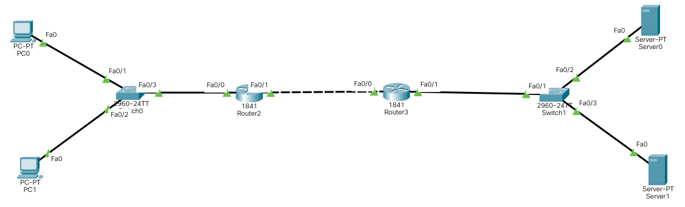

-   Then set-up right Server IP configuration:

    | Name            | Status |
    | --------------- | ------ |
    | IP Address      |        |
    | Subnet Mask     |        |
    | Default Gateway |        |

-   Also set-up its AAA configuration:

    | Client Name | Client IP | Server Type | Key |
    | ----------- | --------- | ----------- | --- |
    |             |           | Tacacs      | abc |
    |             |           | Tacacs      | abc |

    | Username | Password |
    | -------- | -------- |
    |          |          |
    |          |          |

-   Also set-up its DNS configuration:

    | Name | Type     | Detail |
    | ---- | -------- | ------ |
    |      | A Record |        |

-   Then set-up left PC IP configuration:

    | Name            | Status |
    | --------------- | ------ |
    | IP Address      |        |
    | Subnet Mask     |        |
    | Default Gateway |        |
    | DNS Server      |        |

&nbsp;

## Lab Week 7



-   Open left Router console and type:

```
en
conf t

```
