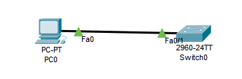
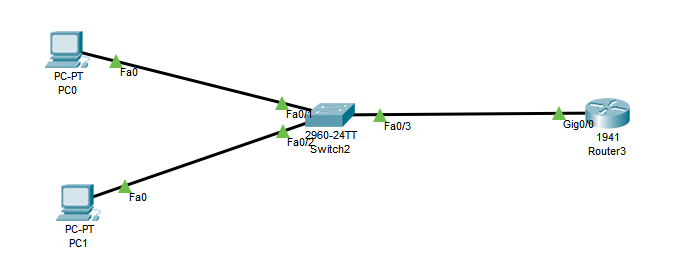
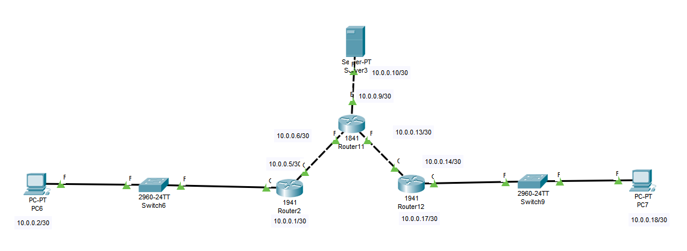

# Tutorial "How to Do Everything"

## Connect Switch to PC with VLAN



- Connect computer to a switch, enter switch console and type:

```
en
conf t
vlan 10
exit
interface vlan 10
no shutdown
ip address 192.168.1.1 255.255.255.252
exit
interface fastEthernet 0/1
switchport mode access
switchport access vlan 10
exit
```

- On computer, enter Ip Configuration menu and set:
  Name | Status
  ---- | ------
  IP Address | 192.168.1.2
  Subnet Mask | 255.255.255.252
  Default Gateway | 192.168.1.1

## Connect Router to PC through Switch without VLAN


- Connect computer to a switch, then switch to a router, then enter router console and type:

```
en
conf t
interface gigabitEthernet 0/0
ip address 192.168.1.1 255.255.255.252
no shutdown
ex
```

- On computer, enter Ip Configuration menu and set:
  Name | Status
  ---- | ------
  IP Address | 192.168.1.2
  Subnet Mask | 255.255.255.252
  Default Gateway | 192.168.1.1

## Connect Router to PC through Switch on the same VLAN


- Enter switch terminal and type:

```
en
conf t
vlan 10
exit
interface vlan 10
no shutdown
ip add 192.168.1.2  255.255.255.248
ex
int fa 0/1
switchport mode access
switchport access vlan 10
ex
int fa 0/2
switchport mode access
switchport access vlan 10
exit
```

- Enter router terminal and type:

```
en
conf t
interface gigabitEthernet 0/0
no sh
ip address 192.168.1.1 255.255.255.248
exit
```

- On computer, enter Ip Configuration menu and set:
  Name | Status
  ---- | ------
  IP Address | 192.168.1.3
  Subnet Mask | 255.255.255.252
  Default Gateway | 192.168.1.2

## Connect two PCs with different VLANs through Switch and Router:



- Connect both computers and router to switch, then open switch console and type:

```
en
conf t
vlan 10
ex
vlan 20
ex
int fa0/1
swi mode ac
swi ac vlan 10
ex
int fa 0/2
swi mo ac
swi ac vlan 20
ex
int fa 0/3
swi mo tr
sw tr all vlan 10,20
ex
```

- Open router console and type:

```
en
conf t
int g0/0
no sh
ex
int g0/0.10
enc dot1Q 10
ip add 192.168.1.1 255.255.255.252
ex
int g0/0.20
enc do 20
ip add 176.10.1.1 255.255.255.252
ex
```

- Set-up PC connected to fa0/1 port of the switch:
  Name | Status
  ---- | ------
  IP Address | 192.168.1.2
  Subnet Mask | 255.255.255.252
  Default Gateway | 192.168.1.1

&nbsp;

- Set-up PC connected to fa0/2 port of the switch:
  Name | Status
  ---- | ------
  IP Address | 176.10.1.2
  Subnet Mask | 255.255.255.252
  Default Gateway | 176.10.1.1

## Connect two PCs with different VLANs through layer 3 Switch


- Connect both PCs to the switch, then open switch console and type:

```
en
conf t
int fa 0/1
swi mo ac
sw ac vlan 10
ex
int fa 0/2
sw mo ac
sw ac vlan 20
ex
int vlan 10
ip address 192.168.1.1 255.255.255.252
ex
int vlan 20
ip address 176.10.1.1 255.255.255.252
ex
ip routing
```

- Set-up PC connected to fa0/1 port of the switch:
  Name | Status
  ---- | ------
  IP Address | 192.168.1.2
  Subnet Mask | 255.255.255.252
  Default Gateway | 192.168.1.1

&nbsp;

- Set-up PC connected to fa0/2 port of the switch:
  Name | Status
  ---- | ------
  IP Address | 176.10.1.2
  Subnet Mask | 255.255.255.252
  Default Gateway | 176.10.1.1

## InterVLAN Routing through two Routers



- In left switch console type:

```
en
conf t
int fa 0/1
swi mo ac
swi ac vlan 10
ex
int fa 0/2
swi mo ac
sw ac vlan 20
ex
int fa 0/3
sw mo tr
sw tr all vlan 10,20
ex
```

- In right switch console type:

```
en
conf t
int fa0/2
swi mod ac
sw ac vlan 10
ex
int fa 0/3
sw mo ac
sw ac vlan 20
no sw ac vlan 20
sw ac vlan 20
ex
int fa0/1
sw mo tr
sw tr al vlan 10,20
ex
```

- In left router console type:

```
en
conf t
Enter configuration commands, one per line.  End with CNTL/Z.
int g0/0
no sh
ex
int g0/0.10
enc
encapsulation d 10
ex
int g0/0.10
ip ad 10.0.0.1 255.255.255.252
ex
int g0/0.20
enc d 20
ex
int g0/0.20
ip add 10.0.0.5 255.255.255.252
ex
int g0/1
no sh
ip add 192.168.1.1 255.255.255.252
ex
ip route 10.0.0.8 255.255.255.252 192.168.1.2
ip route 10.0.0.12 255.255.255.252 192.168.1.2
```

- In right router console type:

```
en
conf t
int g0/0
no sh
ex
int g0/1
no sh
ex
int g0/1.10
enc d 10
ex
int g0/1.10
ip add 10.0.0.9 255.255.255.252
ex
int g0/1.20
enc do 20
ip add 10.0.0.13 255.255.255.252
ex
int g0/0
ip add 192.168.1.2 255.255.255.252
ip route 10.0.0.0 255.255.255.252 192.168.1.1
ip route 10.0.0.4 255.255.255.252 192.168.1.1
```

- Set-up PC connected VLAN 10:
  Name | Status
  ---- | ------
  IP Address | 10.0.0.2
  Subnet Mask | 255.255.255.252
  Default Gateway | 10.0.0.1

&nbsp;

- Set-up PC connected VLAN 20:
  Name | Status
  ---- | ------
  IP Address | 10.0.0.6
  Subnet Mask | 255.255.255.252
  Default Gateway | 10.0.0.5

&nbsp;

- Set-up PC connected VLAN 30:
  Name | Status
  ---- | ------
  IP Address | 10.0.0.10
  Subnet Mask | 255.255.255.252
  Default Gateway | 10.0.0.9

&nbsp;

- Set-up PC connected VLAN 40:
  Name | Status
  ---- | ------
  IP Address | 10.0.0.14
  Subnet Mask | 255.255.255.252
  Default Gateway | 10.0.0.13
